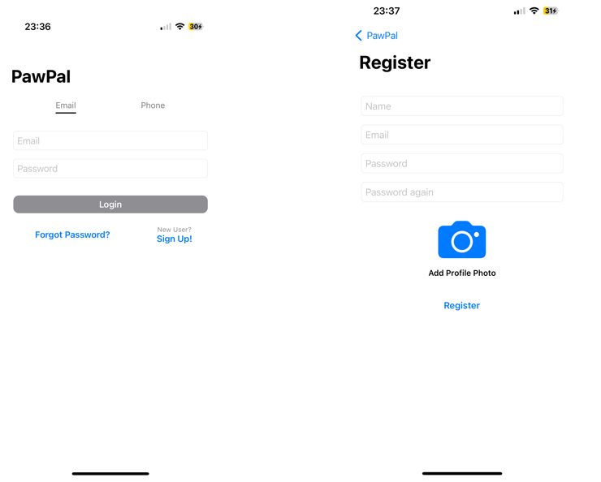
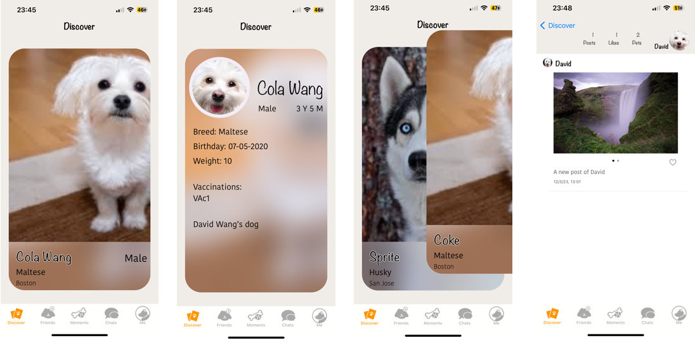
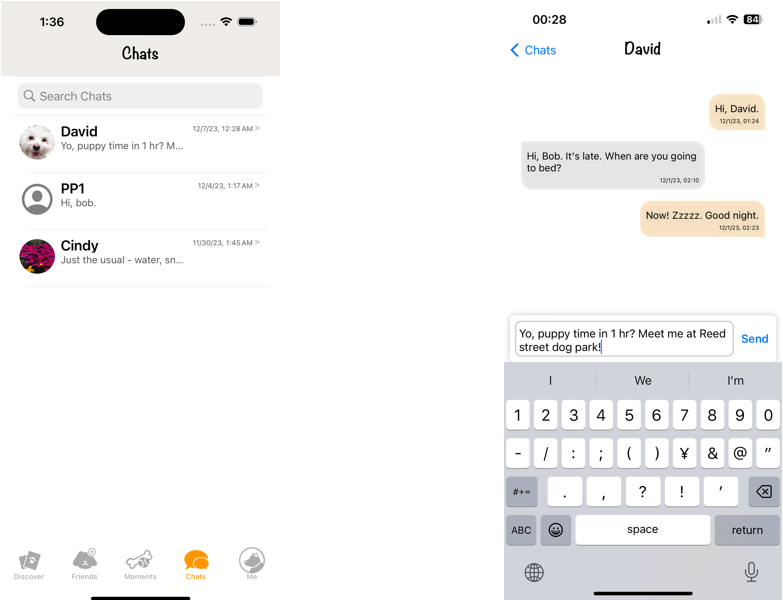
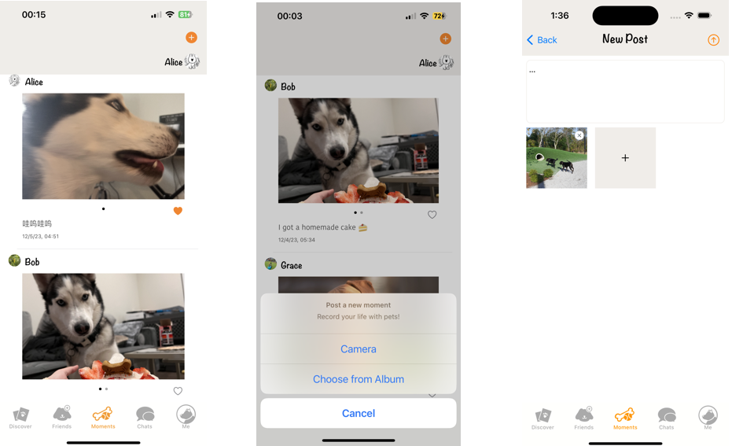
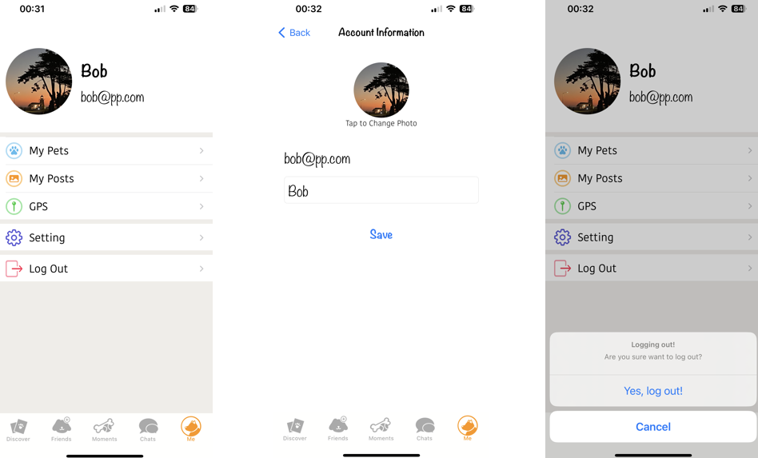
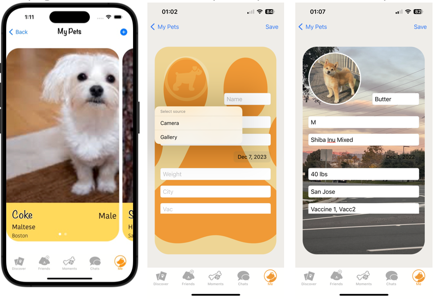
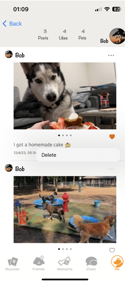
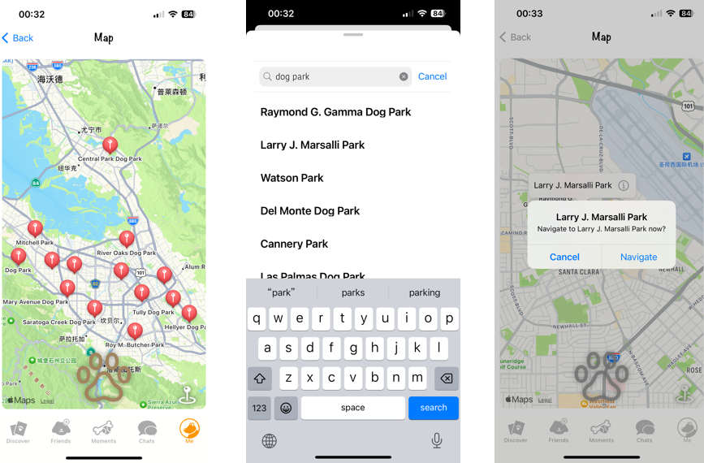

# PawPal
## Where Dogs Find Their Soulmates
This application is designed to facilitate social interactions among dogs and their owners in local dog parks. 
It would serve as a platform for dog lovers to connect, schedule meetups, and create opportunities for their puppies to make new friends in a safe environment. 

## Author
Yisong Cheng [@schromeo](https://github.com/Schromeo/)
Yitian Guo [@YtG12](https://github.com/YtG12/)
Zhengrong Zhang [@zzrcynthia](https://github.com/zzrcynthia/)

# Application Functions

## Sign Up & Log in via Email

## Discover More Pets!
This screen shows pets from all users in a CardView. Left swipe to view next, right swipe to send a friend request, and tap it for more details. Also, tap the pet icon for its owner’s posts.

## Friends Around!
This screen shows all added friends. It allows users to see friends’ moments, chat, and delete that friend. Also, the user can see the friend requests from the right corner and decide whether to approve or not.

## Chat With Your Friends!
This screen shows all chat history and allows users to chat with each other.

## Share Remarkable Moments!
This screen shows all the moments from your friends. Give them a like if you want. Also, users can post a new moment by using a camera or uploading a photo with a text description.  

## Me Page and User Settings
This screen shows options for navigating to my pets, posts, GPS, Setting page, and log out. On the Settings page, user can change their username and icon (with the camera or local gallery.)

### My Pets
In the my-pets section, users can view uploaded pets' info, and upload a new pet card to everyone. 

### My Posts
On the my-post page, user can view and edit(delete) all their moments posted.

### GPS
The GPS page will automatically search for all dog parks around and pin them out. Users can choose to view details and navigate a route. Also, users can search for whatever they want and navigate.

